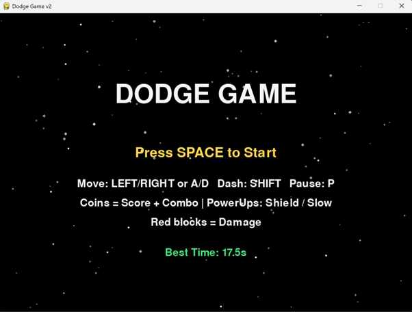
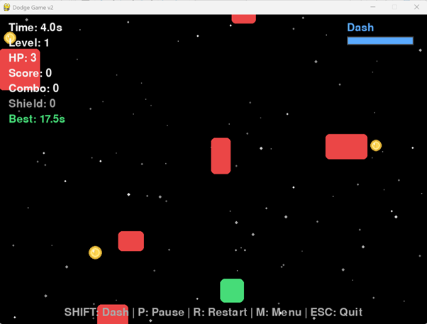

# Dodge Game (Pygame)

Python과 Pygame으로 만든 닷지(Dodge) 게임입니다.

플레이어를 좌우로 움직여 위에서 떨어지는 장애물을 피하고, 코인과 파워업을 활용해 최대한 오래 생존하며 점수를 올리는 것이 목표입니다.  

---

## Game Preview (Version 2)

<p align="center">
  
  
</p>

---

## Game Features (v2)

- 좌 / 우 이동 (A / D 지원)
- **Dash 시스템 + 쿨다운 UI**
- 위에서 떨어지는 장애물 + **좌우 움직이는 패턴 장애물**
- **Coin + Combo 점수 시스템**
- **PowerUps**
  - Shield (1회 피해 무시)
  - Slow (시간 감속)
- **배경 스타필드(패럴랙스 효과)**
- 피격 시 **Screen Shake + Flash Effect**
- Pause / Restart / Menu 시스템
- 최고 생존 기록 자동 저장 (best_time.txt)

---

## Controls

| Key | Action |
-----|--------
← / → , A / D | Move
SHIFT | Dash
P | Pause
R | Restart
M | Back to Menu
ESC | Quit Game

---

## Requirements

- Python 3.9+
- Pygame

---

## Installation

```bash
pip install pygame
```

---

## Run
```
python dodge_game_v2.py
```

---

## Project Structure
```bash
.
├── dodge_game_v2.py
├── dodge_game.py
├── screenshots
│   ├── v2(1).png
│   └── v2(2).png
└── README.md
```

---

## 🧾 버전 히스토리

### v1
1. 기본 닷지(Dodge) 게임 플레이 구현
2. 단순 낙하형 장애물 시스템
3. 생존 시간 기반 점수 시스템

### v2
1. 대시(Dash) 시스템 추가
2. 코인 및 콤보 점수 시스템 적용
3. 파워업 시스템 추가 (Shield / Slow)
4. 패럴랙스 배경(스타필드) 효과 적용
5. 타격 연출(스크린 셰이크, 플래시 효과) 추가
6. 난이도 및 속도 스케일링 개선

---

## 향후 업데이트 계획 (v3)

* 신규 장애물 타입 추가 (레이저, 분열 블록, 가로 이동 패턴 등)
* 상점 및 스킨 시스템 구현
* 효과음 및 배경 음악(BGM) 추가
* 스프라이트 기반 그래픽 적용
* 웨이브 기반 난이도 시스템 도입
